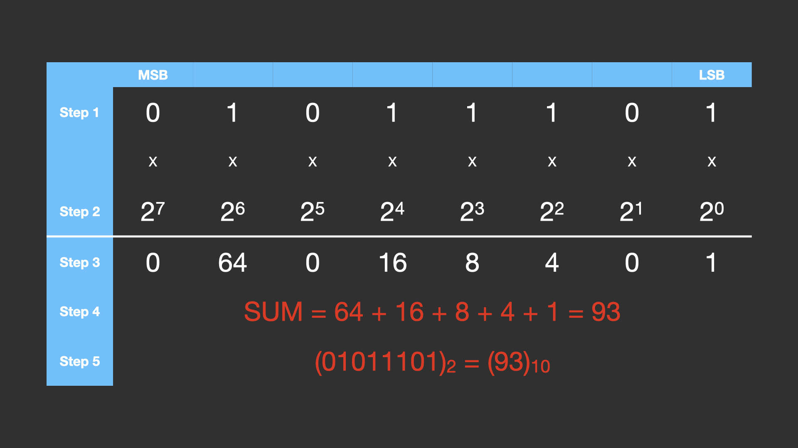
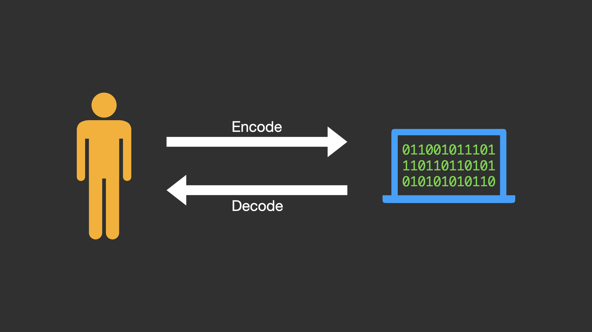
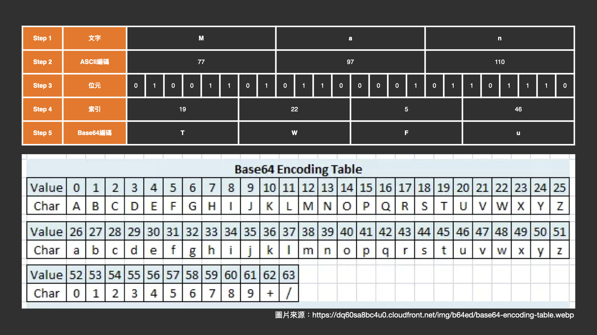

# 1.1 密碼學基礎-編碼篇

## 學習目標

- 認識二進位與十進位
- 學習二進位與十進位之間的轉換
- 認識 ASCII Code
- 了解編碼（Encode）及解碼（Decode）
- 了解 Base64 的原理與應用

## 二進位與十進位的概念

或許你聽過時間的表示使用 60 進位，人類使用 10 進位，但這個進位代表的是什麼意思呢？

以時間為例，每當分針數到 `60` 的時候，時針就會增加 1 小時，這也是進位的基本概念，例如：`0:58` 過一分鐘後變成 `0:59`，再過 1 分鐘就變成 `0:60`，但因為是 60 進位的關係，所以會自動進位，變成 `1:00`。

數字系統的十進位也是相同概念，`8` 的下一個數是 `9`，再下一個數字因為遇到十，所以進位成 `10`；`18` 的下一個數為 `19`，`19` 的下一個數字因為個位數再次遇到十，因此進位成 `20`。

那二進位是什麼呢？顧名思義就是遇到 `2` 就進位，例如：`1` 的下一個數因為遇到 `2`，所以進位成 `10`（讀作：壹零）；`10` 的下一個數是 `11`；`11` 的下一個數原本應該是 `12`，但因為個位數遇到 `2`，因此進位成 `20`，又因十位數遇到 `2`，因此再次進位成 `100`，所以 `11` 的下一個數為 `100`（讀作：壹零零）。

## 二進位與十進位的轉換

### 利用人工運算

如果想將二進位轉成十進位要怎麼做呢？

以二進位數字 `01011101` 為例，先將數字按照順序寫下來（如下圖 Step 1）。接著在各位元下方填上 2 的 n 次方，最低位元之 n 為 0，依序漸增（如下圖 Step 2）所示。最後將各位元相乘（如下圖 Step 3）並加總（如下圖 Step 4），即可獲得二進位數字 `01011101` 的十進位數值為 `93`，表示為下圖 Step 4 之方式。



那要如何將十進位轉成二進位呢？

如下圖所示（圖片來源：[https://pic.pimg.tw/teatime28/1625399452-3635951143-g.png](https://pic.pimg.tw/teatime28/1625399452-3635951143-g.png)），若要將十進位的 `152` 轉換成二進位，可利用短除法計算，並紀錄每次運算的餘數，直到商數為 `1`。接著由上而下寫下餘數，即可將十進位轉換成二進位。故十進位的 `152` 轉換成二進位為 `10011000`。


### 利用程式運算

對於二進位轉十進位，可使用[線上工具](https://www.rapidtables.com/convert/number/binary-to-decimal.html)或利用 Python 程式進行轉換，範例程式如下：

```python
binary_str = "01011101"  # 二進位字串
decimal = int(binary_str, 2)  # 第二個參數 2 表示這是二進位
print(decimal)  # 輸出: 93
```

對於十進位轉二進位，則可使用[線上工具](https://www.rapidtables.com/convert/number/decimal-to-binary.html)或利用 Python 程式進行轉換，範例程式如下：

```python
decimal = 93
binary = bin(decimal)  # 會回傳帶有 '0b' 前綴的字串
print(binary)  # 輸出: '0b01011101'
```

## ASCII Code 是什麼？

人類使用的文字電腦無法解讀，必須將這些文字轉換成二進位的資料才能供電腦讀寫，為了統一文字及二進位資料的轉換規則，美國國家標準學會制定了 ASCII Code 以統一文字及二進位資料間的轉換。

ASCII Code 共有 128 種字元，包含英文大小寫、數字、符號等可視字元，以及不可視字元，例如：換行字元、結束字元等。而當中大寫 `A` 以十進位的 `65` 表示；小寫 `a` 以十進位的 `97` 表示。

ASCII Code 共有 128 種字元，而 128 剛好為 2 的 7 次方，但因在電腦中，一個位元組（Byte）為 8 個位元（Bit），因此 ASCII Code 的二進位表示常記為 8 個位元（Bit），例如：`01000001`、`01100001`。

ASCII Code 的對照表可參考下方網路照片，圖片來源：[https://www.vlsifacts.com/wp-content/uploads/2023/02/ASCII-Code.png](https://www.vlsifacts.com/wp-content/uploads/2023/02/ASCII-Code.png)


## 編碼（Encode）與解碼（Decode）

在接觸編碼時，經常會聽到 `Encode（編碼）` 及 `Decode（解碼）`，這其中代表什麼意思，又該如何分辨嗎？

Encode 和 Decode 其實就是在編碼和人類看得懂的文字之間進行轉換，對於人類看不懂的編碼，需要經過 `Decode` 轉換成人類看得懂的文字；對於人類看得懂的文字，需要經過 `Encode` 將其轉換成編碼。



## Base64 簡介

在上方 ASCII Code 的介紹當中有提到，ASCII Code 的字元僅有 128 種，然而若以二進位儲存資料，有可能會有超出 ASCII Code 範圍的內容，對於文字的傳輸造成障礙。在這種情況下，就可使用 Base64 編碼進行傳輸，因為 Base64 只包含英文字母大小寫（A-Z, a-z）、數字（0-9）及加號（+）和斜線（/），以及填充用的等號（=）。

要將字串轉換成 Base64 除可使用[線上工具](https://www.base64encode.org/)外，亦可使用人工計算，如下圖所示，若要將字串 `Man` 轉換成 Base64 編碼，可先將字串寫下來（如下圖 Step 1 所示）並透過 ASCII 轉換成十進位（如下圖 Step 2 所示）再轉成二進位（如下圖 Step 3 所示），接著將每 6 個位元，組成一組並轉成十進位（如下圖 Step 4 所示），最後對照下方的 Base64 對照表轉成 Base64 編碼（如下圖 Step 5 所示）。



你可能會好奇，8 個位元一組的 ASCII 字串，在轉成 6 個位元一組的 Base64 編碼時，會有除不盡的情況，要如何解決？此時就需要使用填充字元（=）進行填充，詳細填充方式請見維基百科之[範例](https://zh.wikipedia.org/zh-tw/Base64#%E7%A4%BA%E4%BE%8B)。

> [!CAUTION]
> Base64 是編碼不是加密。