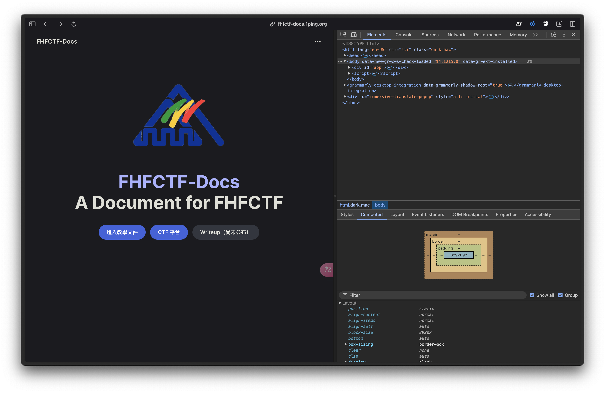
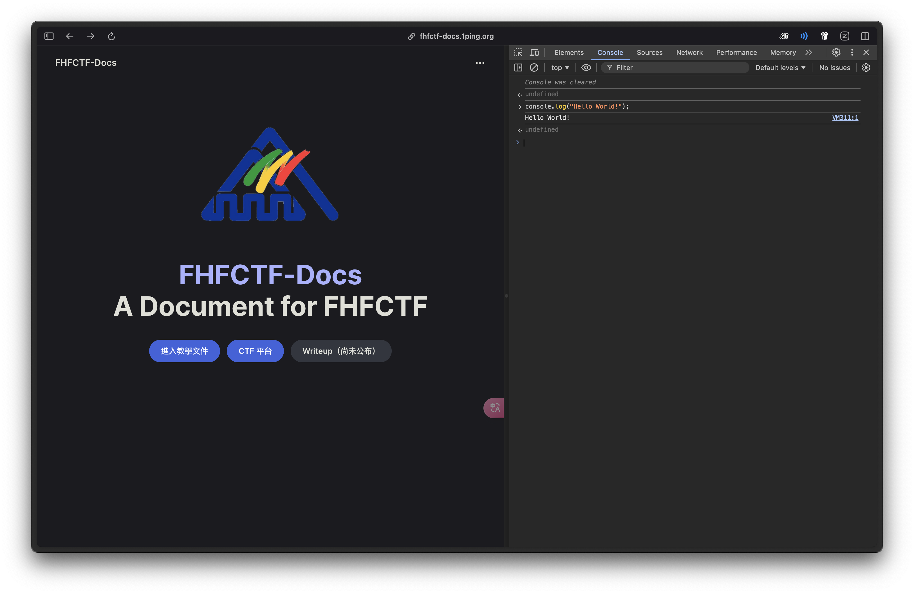
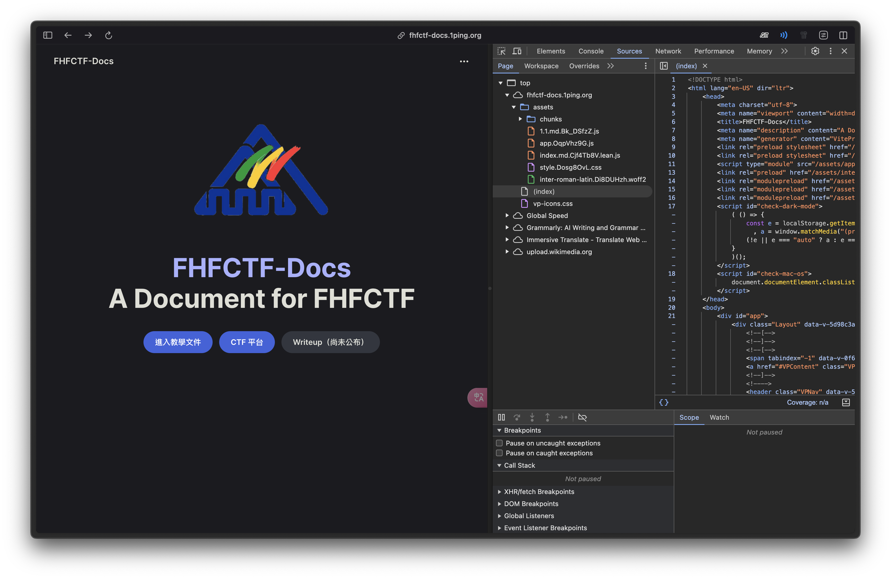
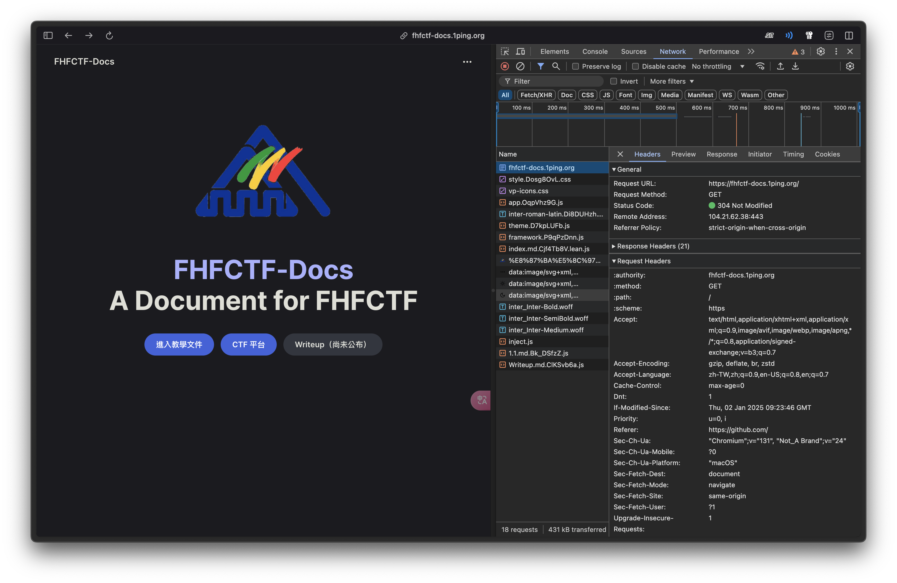
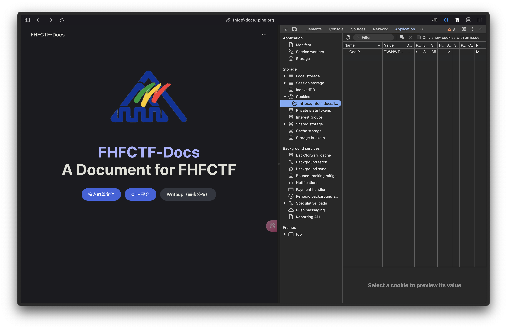

# 3.1 Web 基礎概念

## 學習目標

* 認識網頁三兄弟
* 認識網站檔案結構
* 認識 Cookie
* 使用開發者工具

## 網頁三兄弟

在製作一個網頁時，會使用到網頁三大元素，分別為 HTML、CSS 及 JavaScript，下面用一張圖解釋其分別的用途（圖片來源：[https://d2v4zi8pl64nxt.cloudfront.net/javascript-seo/5948abfc0e2df5.02876591.gif](https://d2v4zi8pl64nxt.cloudfront.net/javascript-seo/5948abfc0e2df5.02876591.gif)）。

* HTMl 代表的是骨架，需要哪些元素、排序元素順序等，都是由 HTML 負責。
* CSS 代表的是皮膚，負責處理網頁的外觀和排版。
* JavaScript（簡稱 JS）代表大腦，負責處理網站的行為，使網站能夠進行動作或與使用者互動。

## 網站架構

一個基本的網站，檔案結構大致如下：

* 網站根目錄存放了 `index.html` 檔，也是網站的主要檔案。每當進入一個網站的根目錄，瀏覽器就會自動存取 `index.html` 檔。
* 在 `assets` 資料夾當中會存放一些照片檔、CSS、JavaScript 檔等，供網站存取使用。
* 在網頁爬蟲及搜尋引擎建立索引時，身為一位~~守法好公民~~，應該按照 `robots.txt` 的規則進行資料的爬蟲，避免抓取到敏感資料或管理介面。不過身為一位~~駭客~~， `robots.txt` 檔就變成他們的天堂了，因為有機會在這個檔案中，看到不該被看到的頁面。
* 網站開發者通常會建立 `sitemap.xml` 檔，在這個檔案中，清楚的標示網站中的各個頁面，以加速瀏覽器建立索引的速度。然而，身為駭客，同樣有機會在當中看到敏感路徑，例如：之前許多學校網站就因為 `sitemap.xml` 造成帳號密碼及 API 的外洩（雖然密碼有經過 Hash），詳見 [HITCON ZeroDay ZDID：ZD-2024-00502](https://zeroday.hitcon.org/vulnerability/ZD-2024-00502)。

## Cookie 簡介

為了讓使用者在短時間操作網站時，不需重複登入帳號，瀏覽器會自動儲存一些數據在本地端，而這些數據就稱為「Cookie」。若 Cookie 外洩，就有可能被駭客從遠端登入受害者的帳號；又或者如果開發者設定的 Cookie 過於簡單，就會造成「存取控制缺陷」的問題。例如：先前有一個教學網站因為 Cookie 沒有經過 Hash，僅使用流水號及使用者姓名作為帳號的驗證條件，造成可以任意登入他人的帳號，詳見 [HITCON ZeroDay ZDID：ZD-2024-00452](https://zeroday.hitcon.org/vulnerability/ZD-2024-00452)。

## 使用開發者工具

### 開啟開發者工具

身為一位駭客或一位開發者，學會使用開發者工具是必不可少的技能。

要想開啟開發者工具有以下三種方法：
1.  點擊快速鍵 F12 或 Ctrl + Shift + C（Mac 使用：Cmd + Option + C）開啟
2.  網頁上方點擊右鍵，然後選擇「檢查」，如下圖所示：
    
3. 按一下右側的「三個點」按鈕，然後依序選取「更多工具」 >「開發人員工具」，如下圖所示：
   

下面將一一介紹開發者工具各分頁的使用方式。

### 元素

1. 點擊「Elements」標籤可查看網頁中的 HTML 內容及相關 CSS 樣式
    
2. 點擊左上角工具，再點擊網頁中的元素查看元素的原始碼
   
3. 點擊左上角「選擇裝置」工具，可測試不同尺寸裝置的顯示效果，在開發網頁的 RWD（響應式網頁設計）時相當方便
   

### 控制台

點擊「Console」可執行 JavaScript 程式

### 資源

點擊「Sources」標籤可查看網頁中索引的所有檔案，包含：HTML、CSS、JS 及照片檔等。

### 網路

點擊「Network」標籤可查看封包紀錄，包含網頁檔案及 API 的請求紀錄等。

### 應用程式

在「Application」標籤的「Cookies」頁面下，可查看及修改網頁的 Cookie。

