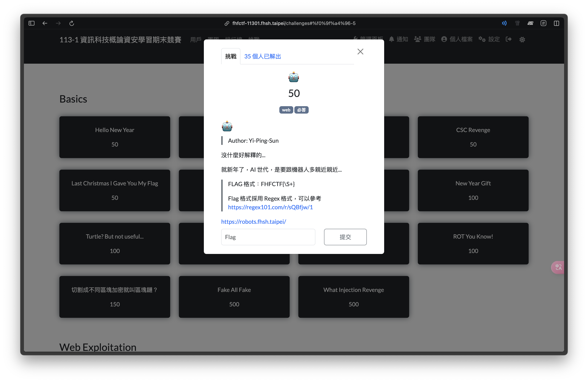
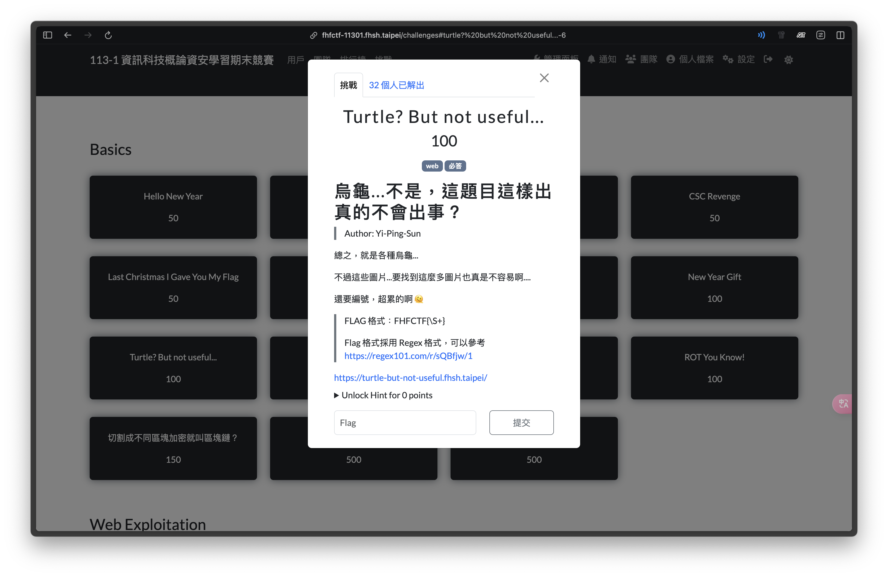
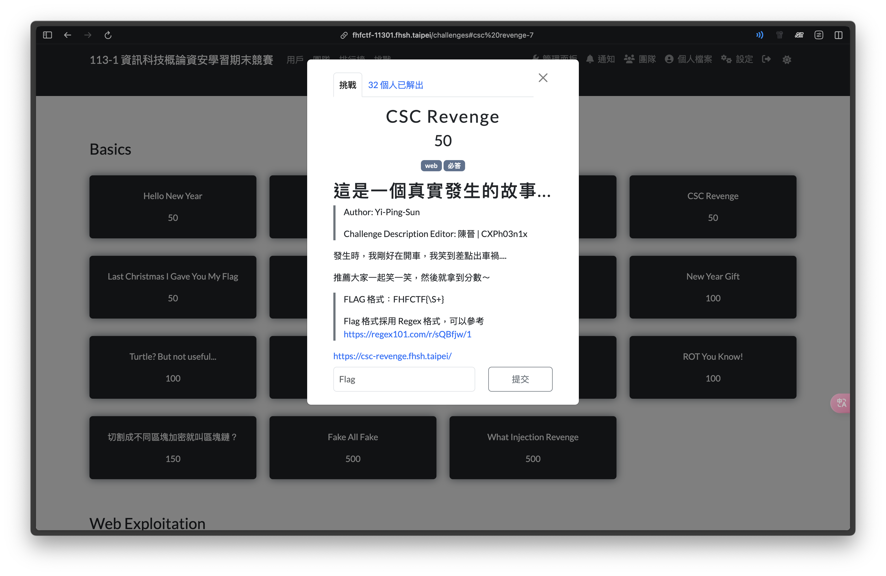
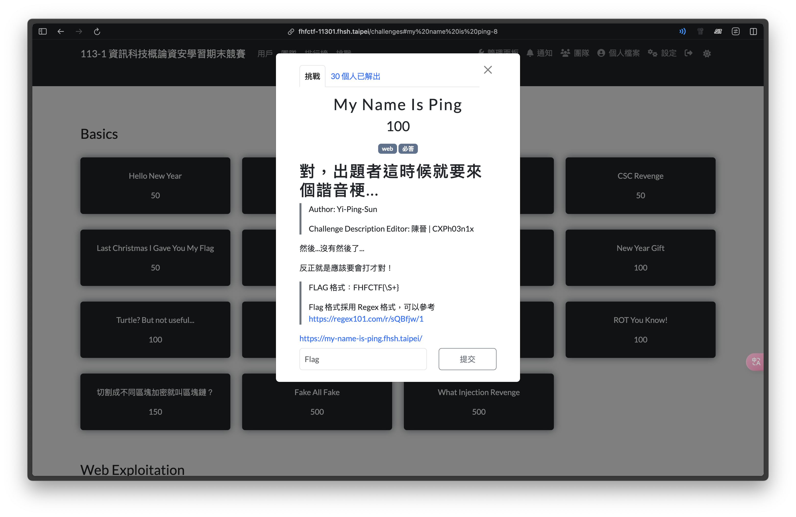
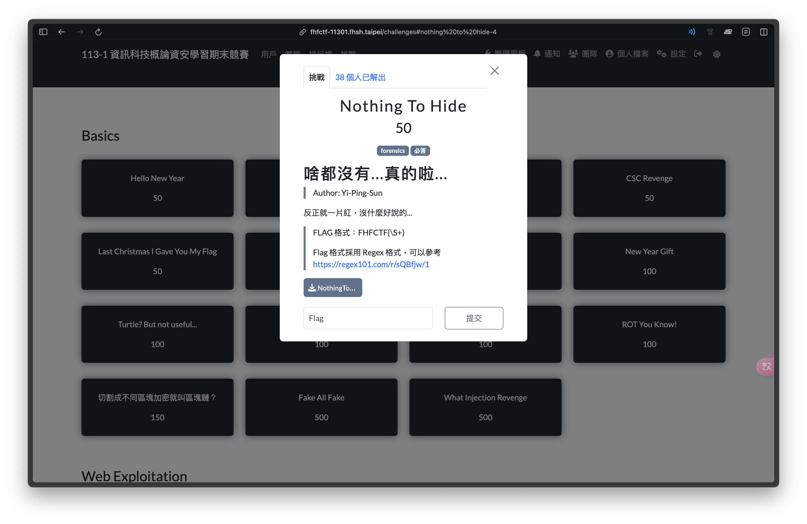
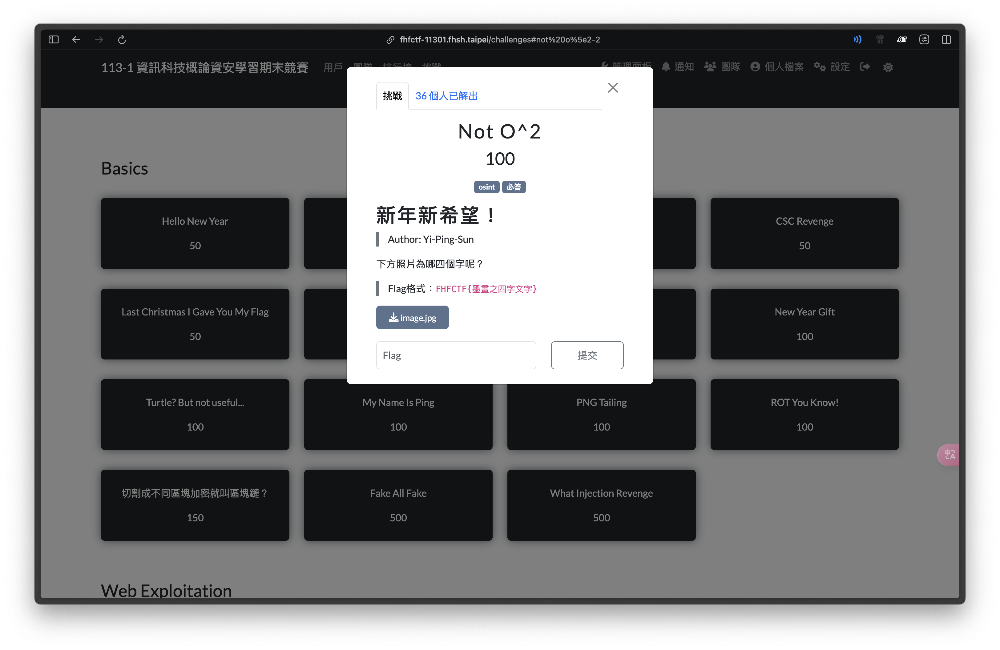

# FHFCTF-11301 Writeup

## Challenge Release

* [https://github.com/1PingSun/FHFCTF_113/tree/main](https://github.com/1PingSun/FHFCTF_113/tree/main)

## Web

### Happy New Year

* Author: tong
* Flag: `FHFCTF{5k1n_15_u51n6_css}`

這題是一個刮刮樂遊戲，要把刮刮樂放在 CTFd 的主頁，但 Flag 在 CSS 檔裡面。

### 🤖

* Author: Ping
* Flag: `FHFCTF{r0b07_4r3_n07_54f3}`

1. 打開開發者工具，在 HTML 原始碼中看到前半部的 Flag
    

2. 打開 robots.txt 觀察，發現有一個 `/s3cr3t.html` 的路徑
    

3. 打開路徑就看到後半部的 Flag 了
    

### Turtle? But not useful

* Author: Ping
* Flag: `FHFCTF{f1nd_7ur7l3}`

1. 打開連結發現路徑為 `/page.html`
2. 網頁中的三張照片路徑分別為 `/01_70.jpeg`、`/02_72.jpeg`、`/03_70.jpeg`
3. 發現三張照片後面的數字疑似為 `FHF` 的 ASCII 編碼
4. 進到 `/` 路徑，看到目錄下的所有檔案內容。
    
5. 將各照片後面的數字分別進行 ASCII to Text，就得到 Flag 了。

### CSC Revenge

* Author: Ping
* Flag: `FHFCTF{y0u_4r3_53r10u5_1n_cl455}`

1. 打開網頁看到有三則最新消息
    

2. 打開 `【預告信】Flag 預告信` 發現測驗結束後才能拿到 Flag，到時候拿到根本沒用 www
    

3. 發現公告的檔案路徑是使用流水號（例如：預告信為 `news_in_170.html`；上一則公告為 `news_in_169.html`
4. 嘗試打開 `news_in_171.html` 的檔案，就得到 Flag 了
    

p.s. 2024 金盾獎決賽入圍名單當時就是被 IDOR 出來，提早 12 小時流出

### My Name Is Ping

* Author: Ping
* Flag: `FHFCTF{5h3ll_m3_plz}`

1. 打開網頁發現是一個 Ping IP 的工具
    

2. 可正常的 Ping 一個 IP
    

3. 加分號就可進行 Command Injection
    

## Forensic

### New Year Gift

* Author: Ping
* Chal file: Gift.png
* Flag: `FHFCTF{1_l0v3_010}`

1. 使用 010 Editor 打開檔案，發現標頭的前四個 Byte 被全部加 1（原為 PNG 標頭的 `89 50 4E 47`）
    

2. 全部減 1 修回 PNG 標頭：`89 50 4E 47`，即可打開照片獲得 Flag。
    
    

### Nothing To Hide

* Author: Ping
* file: hidden.png
* Flag: `FHFCTF{1_4m_h1d1n6_h3r3}`

1. 打開檔案，發現找不到 Flag
    

2. 丟進 StegOnline 選 LSB Half 就看到 Flag 了
    

說明：此題使用 LSB 把 Flag 藏起來，背景色為 `#FF0000` 而 Flag 顏色為 `#FE0000`

## OSINT

### Not O^2

* Author: Ping
* Flag: `FHFCTF{以書養氣}`

#### 題目說明

下方墨畫照片為哪四個字，Flag 為 `FHFCTF{墨畫之四字文字}`

題目照片：

1. 觀察照片看到「國防醫學院」及「養氣」等字詞是看得懂的內容
2. 使用上述兩字詞進行關鍵字搜尋，發現國防醫學院相關的 domain 有 `www.ndmctsgh.edu.tw`（官網）及 `wwwndmc.ndmctsgh.edu.tw`（圖書館）。
3. 分別使用關鍵字「養氣」對兩 domain 搜尋，就可發現在圖書館網站出現相關搜尋結果。
    

4. 瀏覽搜尋結果發現為「以書養氣」四字，並掛於圖書館二樓牆面。
5. 搜尋關鍵字「國防醫學院 圖書館」，驗證確實為該幅墨畫。
    